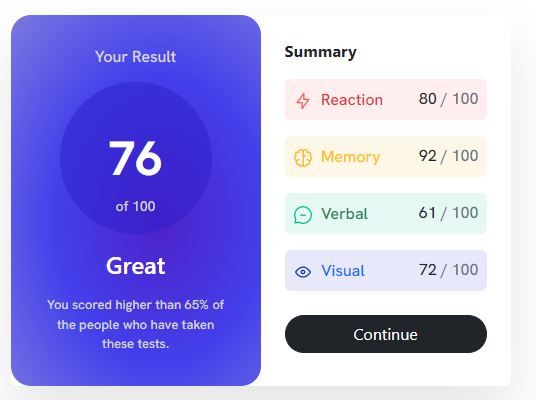

# Frontend Mentor - Results summary component solution

This is a solution to the [Results summary component challenge on Frontend Mentor](https://www.frontendmentor.io/challenges/results-summary-component-CE_K6s0maV).

## Table of contents

- [Overview](#overview)
  - [The challenge](#the-challenge)
  - [Screenshot](#screenshot)
  - [Links](#links)
- [My process](#my-process)
  - [Built with](#built-with)
  - [What I learned](#what-i-learned)
  - [Useful resources](#useful-resources)
- [Author](#author)
- [Acknowledgments](#acknowledgments)

## Overview

### The challenge

Users should be able to:

- View the optimal layout for the interface depending on their device's screen size
- See hover and focus states for all interactive elements on the page

### Screenshot




### Links

- Live Site URL: [Live Site](https://jgeev.github.io/results-summary-component-main/)

## My process

### Built with

- Bootstrap
- Mobile-first workflow

### What I learned

```html
<span class="float-end"></span>
```

```css
.row .col-md-6:last-child .card-body div.rounded-2:nth-child(2) {
  background-color: hsla(0, 100%, 67%, 0.1);
}
```

### Useful resources

- [Float](https://www.youtube.com/watch?v=wKjHj-EE_QE) - Bootstrap float classes
- [CSS](https://stackoverflow.com/questions/25923623/change-hover-color-on-a-button-with-bootstrap-customization) - Helped with css effects for button hover

## Author

- Github - [jgeev](https://github.com/jgeev)
- Frontend Mentor - [@jgeev](https://www.frontendmentor.io/profile/jgeev)

## Acknowledgments

Thank you Frontend Mentor for the challenge
